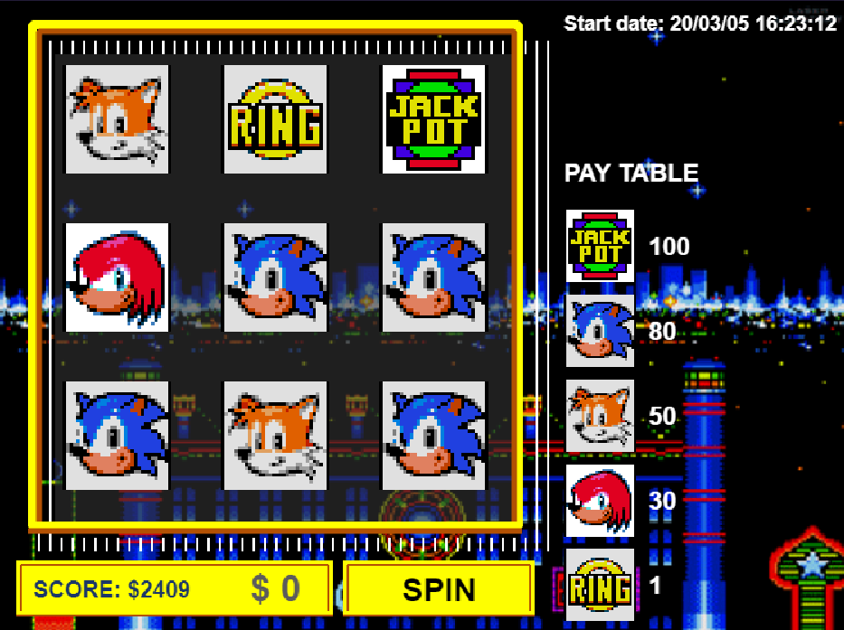

# Sonic fan-made slots game in Phaser 3

## Requirements

For development, you will only need Node.js installed on your environement.

### Node

[Node](http://nodejs.org/) is really easy to install & now include [NPM](https://npmjs.org/).
You should be able to run the following command after the installation procedure
below.

    $ node --version
    v12.16.1

    $ npm --version
    6.13.4

## Install

    $ git clone https://github.com/Gohchi/slots.git
    $ cd slots
    $ npm install

## Start

    $ npm start
    
# A preview

## Legal

This is released under the [MIT License](http://mit-license.org/)
